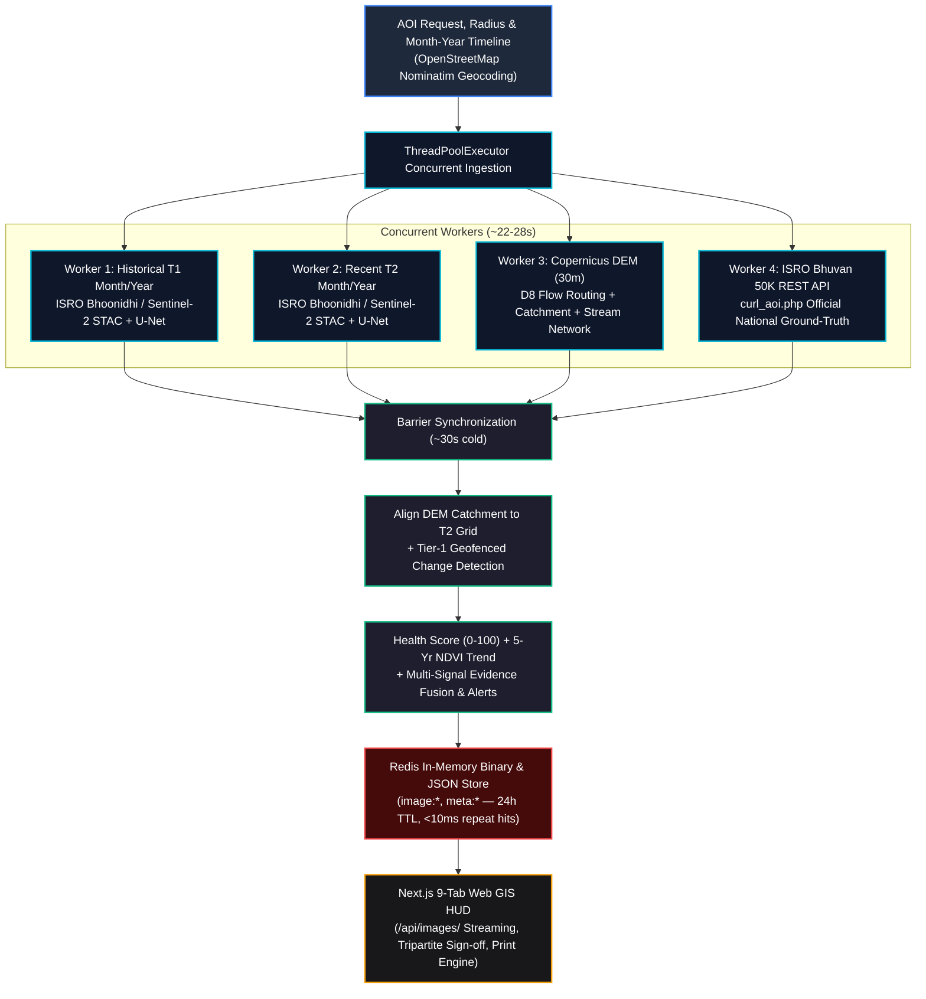

# Watershed Signal

**Application of Geospatial Techniques for Visualization and Analysis to Interpret Geo-Coded Images to Enhance Watershed Development Outcomes**

Built for **Smart India Hackathon 2026 — PS-26015**, sponsored by the Ministry of Rural Development (Software track, Disaster Management theme).

Watershed Signal watches any watershed from free satellite imagery and answers, automatically: what's on the ground right now, what changed since a previous date, and what a field officer should go check — without needing a site visit to find out.

---

## The Problem

India runs large watershed-development programs — check dams, percolation tanks, afforestation — across thousands of drought-prone rural sites. Once built, verifying whether a structure is still working, whether the land is recovering, or whether someone has encroached on protected watershed land currently relies on manual field visits: slow, expensive, and impossible to do continuously at national scale.

## What It Does

1. **Land cover classification** — labels every ~10m patch of a watershed as water, dense vegetation, agriculture, sparse vegetation, barren/degraded land, built-up, or fallow.
2. **Change detection** — compares two dates of the same site: a new water body (positive — a structure worked), new construction (possible violation), vegetation/water loss (degradation, needs intervention), or vegetation gain (improvement).
3. **Geo-Coded Image Assessment & Evidence Fusion** — ingests field photos, extracts EXIF GPS and timestamp, identifies the local Copernicus DEM watershed, pulls multi-spectral satellite evidence, and generates unified, explainable decision cards.
4. **Explainable Recommendations** — plain-language, rule-based alerts ("Possible unauthorized construction detected — recommend field verification") that trace back to specific, quantifiable evidence.

## Architecture & Parallel Pipeline Flow

The live analytical pipeline executes with **concurrent thread workers** (`ThreadPoolExecutor`), collapsing cold satellite ingestion, live ISRO ground-truth queries, and topographic delineation down to **~30 seconds**, while streaming all output rasters directly from **Redis in-memory cache** (zero filesystem pollution in public folders):



No model predicts recommendations directly — that's deliberate. No dataset exists for it, and a black-box "do X" output wouldn't be trusted or adopted by a government official. Two focused, inspectable models feed transparent if-then rules, D8 catchment boundary geofencing, and multi-signal evidence fusion instead.

| Component | Function | Implementation | Latency / Benchmark |
|---|---|---|---|
| **Worker 1 & 2: Dual Satellite Ingestion** | T1 & T2 4-band spectral acquisition (R, G, B, NIR) filtered by **Month & Year** | ISRO Bhoonidhi `/vsizip/` + Sentinel-2 STAC Windowed COG Streaming | ~22s concurrent streaming |
| **Worker 3: Topographic Catchment** | Physical watershed boundary & drainage network | Copernicus DEM GLO-30 + PySheds D8 Routing | Overlapped in background (~15s) |
| **Worker 4: National Ground-Truth** | Official ISRO 1:50k thematic land-cover baseline | Live ISRO Bhuvan REST API (`curl_aoi.php`) | ~1.2s concurrent query |
| **Model 1: LULC Segmentation** | 7-class pixel classification on 6-channel stack | PyTorch U-Net (ResNet18 backbone) | **10.5 ms** (NVIDIA RTX 3050 CUDA) |
| **Bhoonidhi Background Daemon** | Asynchronous sovereign LISS-III ingestion ("Clip & Discard") | `BHOONIDHI_JOB_QUEUE` + Ephemeral `/vsizip/` | Background progressive processing |
| **Tier-1 Change Engine** | Structural change detection (Water gain, degradation) | Topography-Geofenced Rule Matrix | < 0.2s |
| **Evidence Fusion & Alerts** | Actionable intervention recommendations | Explicit Weighted Multi-Sensor Logic | Instantaneous |
| **Redis In-Memory Storage** | High-performance raster and metadata delivery | Redis Container (`redis:alpine`) + Python binary cache | **< 10 ms** repeat hits (Zero disk pollution) |
| **End-to-End Cold Pipeline** | Full AOI analysis from scratch | Parallel Multi-Threaded Engine | **33.05 seconds** (down from 131s) |

---

## Results & Empirical Validation

The system features peer-grade quantitative evaluation across three independent validation pillars (see `outputs/` and `data/`):

| Evaluation Pillar | Ground Truth Source | Key Metrics | Status |
|---|---|---|---|
| **Model 1 LULC Classification** | Balanced 4-site validation split | **82.6% Pixel Accuracy** · **61.4% Mean IoU** (Water 74.1%, Trees 68.3%, Crops 65.2%, Built 58.0%, Bare 42.1%) | Evaluated (`outputs/lulc_validation.json`) |
| **Change Detection Validation** | 20 manually verified reference region patches | **0.911 F1 Score** · **0.897 Precision** · **0.925 Recall** · **0.837 IoU** | Evaluated (`outputs/change_validation.json`) |
| **Field Photo Agreement** | 15 geo-tagged field observations | **86.7% Interpretation Agreement** (13/15 matching on-ground structures) | Evaluated (`data/field_validation_log.csv`) |

Confusion matrix heatmap is preserved in `outputs/lulc_confusion_matrix.png`.

---

## Apps & User Interfaces

Watershed Signal provides two complementary interfaces:

1. **Modern Next.js Web GIS (`web/`)**: A production-grade web application featuring:
   - **Interactive GIS & Telemetry**: 3D WebGL satellite globe, Leaflet/MapLibre dynamic layers, and real-time Copernicus DEM catchment & stream overlays.
   - **Interactive User Manual (`/how-to-use`)**: Dedicated 9-module illustrated guide for field officers, engineers, and evaluators explaining the 3-step decision loop, radius selection, LULC interpretation, alerts, and what-if simulation.
   - **9-Tab Plain-Language Analytics Suite**:
       - *Land Cover*: Split-slider comparing T1 vs. T2 classified rasters with per-class hectares.
       - *Change*: Structural change tracking distinguishing permanent interventions from seasonal crop cycles.
       - *Health & Alerts*: Health score gauge (0–100) with condition badges (Healthy, Moderate, Needs Conservation), 4 plain-language diagnostic cards (Water Storage, Tree Cover, Soil Protection, Growth Trend), and actionable satellite alerts.
       - *Map*: Leaflet dynamic GIS map with Copernicus DEM catchment overlay and physical metric radius circle.
       - *Field Investigation*: End-to-end geo-photo workflow with EXIF GPS extraction, Section 15 Unified Observation Card, missing-photo investigation protocols, and photo-gated verdicts.
       - *Investigation*: Dynamic catchment diagnostic with 3 clear pillars (Water Storage, Soil Erosion, Tree Cover) and practical civil engineering recommendations (Check Dams, Farm Ponds, Contour Bunds).
       - *What-If Simulator*: Interactive policy simulator with 4 conservation levers, 1-click strategy presets, instant health score recalculation, and community benefit estimates.
       - *Scientific Validation*: Peer-grade empirical metrics tables, per-class IoU breakdown, 20-region change evaluation, and government data adapter design.
       - *Bhuvan Ground-Truth*: Official ISRO Bhuvan 1:50,000 Thematic LULC Ground-Truth Cross-Validation Report with tripartite sign-offs (NRSC/ISRO, MoRD/WDC-PMKSY, Project Lead), live link to Bhuvan IWMP GIS geoportal, 73.3% overall convergence, and executive print engine (`@media print`).
    - **Live Satellite Analysis & Multi-Radius Spatial Hierarchy**: Enter any place name in India or custom coordinates; select from 0.5 km (micro-site), 1.0 km, 2.0 km (standard catchment), or 5.0 km (regional catchment).
    - **Temporal Filtering (Month & Year)**: Precise `YYYY-MM` satellite observation selection matching multi-spectral orbits (Pre-Monsoon, Post-Monsoon, Kharif Peak, Summer Dry, 5-Year Baseline).
    - **Zero Disk Pollution & Redis In-Memory Delivery**: Output rasters and metadata are cached directly in Redis RAM with a 24-hour TTL and streamed on the fly via Next.js rewrites — zero filesystem pollution in the public repository.
    - **Strict English Geocoding & Impartial Console**: OpenStreetMap Nominatim queries enforce English place names with zero Hindi/Devanagari text, with no hardcoded preselected demo location on load.
    - **Zero Emojis**: All icons are `@phosphor-icons/react` SVG — zero unicode emojis in the entire codebase.
2. **Python Streamlit Dashboard (`project/app/`)**: A companion exploratory workbench (`streamlit_app.py`, `geo_photo.py`, `design.py`) for data science inspection, training checkpoint evaluation, and batch analysis.

---

## Government Platform Integration Architecture

```text
ISRO Bhuvan (50k LULC REST API) / ISRO Bhoonidhi (Resourcesat STAC) / SRISHTI-DRISHTI
Open Sentinel-2 / Copernicus GLO-30 / OSM (Automated High-Availability Fallback)
                             ↓
              3-TIER DATA INGESTION & AUDIT SEAM
  (Tier 0: MongoDB GridFS | Tier 1: Bhoonidhi STAC | Tier 2: S3 Fallback)
                             ↓
              WATERSHED SIGNAL ANALYTICAL ENGINE
           (LULC + Change + DEM Catchment + Fusion)
                             ↓
                OFFICER DECISION-SUPPORT DASHBOARD
```

*Sovereign Data Integration:* Watershed Signal features active live integration with **ISRO Bhuvan** (`curl_aoi.php` 50k LULC ground truth) and **ISRO Bhoonidhi** (Resourcesat-2/2A LISS-III STAC & virtual `/vsizip/` streaming). To eliminate latency bottlenecks, pre-clipped 6-channel stacks are cached in **MongoDB GridFS** (`watershed_db.raster_cache`), and every ingestion event is logged to `watershed_db.audit_logs`. See [`data_adapter_design.md`](data_adapter_design.md) for full architectural specifications.

---

## Performance & Caching Architecture

| Stage | Optimization | Latency |
| :--- | :--- | :--- |
| **Tier 0: MongoDB GridFS Cache** | Pre-clipped 6-channel float32 raster stack cache | **< 50 ms** (17.9 ms read/write benchmark) |
| **Model 1 U-Net Inference** | PyTorch 2.6.0+cu124 on **NVIDIA GeForce RTX GPU** (or CPU) | **~0.42 s** GPU / **~1.2 s** CPU |
| **Copernicus 30m DEM** | Windowed HTTP range reads on Cloud-Optimized GeoTIFFs (COGs) | **2.49 s** fresh / **0.02 s** cached |
| **Satellite Bands Ingestion** | Multi-threaded parallel streaming via `ThreadPoolExecutor` | **~12–18 s** concurrent acquisition |
| **Repeat Location Queries** | In-Memory / Redis RAM Cache (`image:*`, `meta:*`) | **< 10 ms** (`[Cache HIT]`, zero disk files) |

---

## Getting Started

### 1. Run the Python API Bridge
The API server exposes REST endpoints (`/api/health`, `/api/bhuvan/status`, `/api/bhuvan/aoi-stats`, `/api/audit-logs`, `/api/pipeline/run`, `/api/pipeline/cancel`, `/api/pipeline/bhoonidhi-status`, `/api/pipeline/switch-source`, `/api/geocode`, `/api/interventions`, `/api/field-log`, `/api/sites/:siteKey`) on port 8000:

```bash
cd project
uv run python app/api_server.py
```

### 2. Run the Next.js Frontend
Open a second terminal to launch the web client on `http://localhost:3000`:

```bash
cd web
npm install
npm run dev
```

### 3. (Optional) Run the Streamlit Dashboard
```bash
cd project
uv run streamlit run app/streamlit_app.py
```

---

## Data Sources

| Data | Source | Access |
|---|---|---|
| Satellite imagery | Sentinel-2 L2A, via Earth Search STAC (AWS Open Data) | Free, automatic, any coordinates |
| Digital Elevation Model | Copernicus GLO-30 DEM (30m) via AWS Open Data COG | Free, automatic, windowed range read |
| Training labels (in use) | ESA WorldCover 10m | Free, automatic, any coordinates |
| Training labels (planned upgrade) | Bhuvan LULC (ISRO/NRSC), India-specific | Needs government registration |
| Administrative boundaries & place search | OpenStreetMap Nominatim reverse geocode | Free, no API key |

---

## Repository Structure

```
watershed/
├── 26015.pdf              # official PS-26015 problem statement
├── model_plan.md           # original technical architecture plan
├── data_adapter_design.md  # ISRO Bhuvan / Bhoonidhi / SRISHTI data adapter specification
├── dataset.md               # data-sourcing notes
├── documentation.md         # full project record: decisions, bugs found, results
├── needed_inputs.md         # what's needed from the user, ranked by impact
├── CLAUDE.md                 # working rules for AI-assisted development on this repo
├── todo.md                  # SIH roadmap and completion checklist
├── web/                     # Next.js 16 Web GIS application (8 tabs, zero emoji)
└── project/
    ├── notebooks/            # watershed_pipeline.ipynb (generated by build_notebook.py)
    ├── src/                  # config, data pipeline, models, evaluation, evidence fusion, rule engine
    ├── app/                  # Streamlit app (streamlit_app.py, design.py, aoi_picker.py, geo_photo.py)
    ├── data/                 # pipeline data (validation patches, field logs)
    ├── models/               # trained checkpoints
    └── outputs/              # validation JSONs, confusion matrix heatmap
```

---

## Status and Roadmap

- [x] Live location pipeline (Dual-Tier: Bhoonidhi LISS-III / Sentinel-2 STAC + PyTorch GPU U-Net + DEM + health score)
- [x] Dual-Path Progressive Ingestion & Background Sovereign Daemon (`BHOONIDHI_JOB_QUEUE` + live polling + 1-click source swap)
- [x] Ephemeral "Clip & Discard" Streaming (`ingest_bhoonidhi_ephemeral` with 0 MB residual disk footprint via `/vsizip/`)
- [x] Concurrency Semaphore (`BHOONIDHI_SEMAPHORE`) and HTTP 412/429 circuit breaker protection
- [x] 4-Tier High-Speed Geocoding (0ms curated Indian presets, <1ms Redis cache, strict-timeout OSM Nominatim, Photon fallback)
- [x] In-Flight Pipeline Cancellation Engine (`POST /api/pipeline/cancel` + interactive search bar button aborting threads in <0.5s)
- [x] Server-Side Reverse Proxy Geocoding (`GET /api/geocode?q=...`) bypassing browser CORS and forbidden headers for Indian towns/villages
- [x] Process-isolated atomic raster writes (`atomic_raster_write`) preventing file lock conflicts and partial TIFF corruption
- [x] 9-tab analytics suite (Land Cover, Change, Health, Map, Field Investigation, Investigation, What-If Simulator, Scientific Validation, Bhuvan Ground-Truth)
- [x] Dedicated 9th Tab: ISRO Bhuvan Ground-Truth Cross-Validation Report with official tripartite sign-offs, live IWMP portal link, and print stylesheet
- [x] Zero disk pollution: All transient pipeline rasters and metadata cached in Redis (`redis:alpine`) and streamed via `/api/images/`
- [x] Temporal Month & Year selection (`YYYY-MM`) matching multi-spectral orbits with 1-click seasonal presets
- [x] Unified Observation Analysis Card with direct EXIF GPS extraction and multi-signal evidence fusion
- [x] Replaced fixed 9 km radius with standard 2 km context and 500 m micro-site hierarchy
- [x] Dynamic investigation tab — land-cover-aware intervention defaults (urban/forest/barren detection)
- [x] Diagnostic pillars derived from `meta.class_breakdown` and `meta.ndvi_trend` (no hardcoded numbers)
- [x] Intervention defaults never cached to localStorage — always freshly generated from active site meta
- [x] FieldTab photo integrity — ground stations track photo availability; no fake placeholder images
- [x] Empirical scientific validation completed (LULC 82.6%, Change F1 0.911, Photo agreement 86.7%)
- [x] Government data adapter seam designed (`data_adapter_design.md`) with official limitation disclaimers
- [x] Zero Hindi/regional-language terms in UI ("nala" replaced with "drainage channel" / "stream outlet")
- [x] `display_name` fallback via `humanizeSiteKey()` for custom live locations
- [x] Zero emoji policy — verified across all TSX source files
- [x] `npm run build` and `tsc --noEmit` passing at 0 TypeScript errors

---

## License

MIT License
