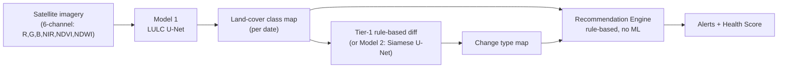

# Watershed Signal

**Application of Geospatial Techniques for Visualization and Analysis to Interpret Geo-Coded Images to Enhance Watershed Development Outcomes**

Built for **Smart India Hackathon 2026 — PS-26015**, sponsored by the Ministry of Rural Development (Software track, Disaster Management theme).

Watershed Signal watches any watershed from free satellite imagery and answers, automatically: what's on the ground right now, what changed since a previous date, and what a field officer should go check — without needing a site visit to find out.

---

## The problem

India runs large watershed-development programs — check dams, percolation tanks, afforestation — across thousands of drought-prone rural sites. Once built, verifying whether a structure is still working, whether the land is recovering, or whether someone has encroached on protected watershed land currently relies on manual field visits: slow, expensive, and impossible to do continuously at national scale.

## What it does

1. **Land cover classification** — labels every ~10m patch of a watershed as water, dense vegetation, agriculture, sparse vegetation, barren/degraded land, built-up, or fallow.
2. **Change detection** — compares two dates of the same site: a new water body (positive — a structure worked), new construction (possible violation), vegetation/water loss (degradation, needs intervention), or vegetation gain (improvement).
3. **Recommendations** — plain-language, rule-based alerts ("Possible unauthorized construction detected — recommend field verification") that trace back to a specific, auditable reason — not a black-box output.

## Architecture



No model predicts recommendations directly — that's deliberate. No dataset exists for it, and a black-box "do X" output wouldn't be trusted or adopted by a government official. Two focused, inspectable models feed transparent if-then rules instead.

| Component | Predicts | ML? |
|---|---|---|
| Model 1 — U-Net (ResNet18 encoder) | Land-cover class per pixel, single date | Yes |
| Tier-1 diff / Model 2 (Siamese U-Net) | Change type per pixel, between two dates | No / Yes |
| Recommendation Engine | Alerts + suggested actions | No — pure rule-based logic |

## Results

Model 1 trained on a pool of 4 real sites (chosen to cover classes any single site lacked — see [documentation.md](documentation.md) for how each was picked and verified):

| Site | Why it's in the training pool |
|---|---|
| Kadwanchi Watershed, Jalna, Maharashtra | Primary site — real Indo-German Watershed Development Programme project (1888 ha), actual check dams/percolation tank |
| Tamhini Ghat, Pune, Maharashtra | Fixed a near-total dense-vegetation gap (63% tree cover here) |
| Donimalai Mine, Ballari, Karnataka | Fixed a near-total barren-land gap (4.5% exposed ground here) |
| Jayakwadi Dam / Godavari river, Paithan, Maharashtra | Fixed river/large-water tracing (49% water here; added after a live unseen-location query failed on a real river) |

Latest Colab retrain (class-weighted loss + mean-IoU checkpoint selection, leak-free spatial-block split, corrected full-extent Kadwanchi data):

**Mean IoU: 49.1%** · **Pixel accuracy: 78.2%** — per-class IoU: water 82.5%, agriculture 71.2%, dense vegetation 66.8%, sparse vegetation 49.1%, barren 35.9%, built-up 30.4%, fallow 7.5% (recovered from a 0.000 collapse under the old unweighted loss; fallow remains the hardest class). See [documentation.md](documentation.md) section 9 for the full history, including the superseded 65.9%/81.2% baseline from before the split/coverage corrections.

Before pooling in the auxiliary sites, dense vegetation and barren land scored **0.004 and 0.000 IoU** — complete failures, from having almost no training examples. See [documentation.md](documentation.md) for the full before/after story, including the two mistaken guesses (Anantapur city, the Chambal ravine belt) that didn't pan out before Donimalai did.

## App

A Streamlit app (`project/app/`) wraps the trained model: pick one of the three trained-site presets (Kadwanchi, Tamhini Ghat, Donimalai — Jayakwadi is training-only), or search/enter coordinates for anywhere else — every location runs the same live pipeline (fetch fresh Sentinel-2 imagery, run the model, diff two dates) and populates Land Cover, Change, Health & Alerts, and an interactive Map. Locations outside the trained set are clearly marked **LIVE · UNSEEN LOCATION** rather than presented with the same confidence as the trained sites. The app is deployed (Streamlit Community Cloud, `deploy` branch) with a Google Cloud Run Dockerfile fallback; a Next.js marketing/demo frontend (`web/`, precomputed real pipeline outputs, no live backend) accompanies it.

```
.venv/Scripts/python.exe -m streamlit run app/streamlit_app.py
```

## Getting started

**Train / retrain the model** — open `project/notebooks/watershed_pipeline.ipynb` in Google Colab (free T4 GPU), `Runtime → Change runtime type → T4 GPU`, then `Runtime → Run all`. Data/checkpoints persist to your Google Drive.

**Run the app locally** — needs the trained checkpoint:

```bash
cd project
python -m venv .venv
# torch/torchvision first, as an EXPLICITLY PINNED matched pair, from PyTorch's own
# CUDA index -- installing them any other way (unpinned, separately, or letting a later
# pip install pull one in as a dependency) has bitten this project twice: a CPU-only
# build with no error, and a torch/torchvision version mismatch that fails at import
# time. See requirements.txt's header comment for both incidents.
.venv/Scripts/python.exe -m pip install torch==2.6.0 torchvision==0.21.0 --index-url https://download.pytorch.org/whl/cu124
.venv/Scripts/python.exe -m pip install -r requirements.txt
# bring models/model1_lulc_unet.pt down from your Colab Drive output
.venv/Scripts/python.exe -m streamlit run app/streamlit_app.py
```

## Data sources

| Data | Source | Access |
|---|---|---|
| Satellite imagery | Sentinel-2 L2A, via Earth Search STAC (AWS Open Data) | Free, automatic, any coordinates |
| Training labels (in use) | ESA WorldCover 10m | Free, automatic, any coordinates |
| Training labels (planned upgrade) | Bhuvan LULC (ISRO/NRSC), India-specific | Needs registration |
| Place search | OpenStreetMap Nominatim | Free, no API key |

## Repository structure

```
watershed/
├── 26015.pdf              # official PS-26015 problem statement
├── model_plan.md           # original technical architecture plan
├── dataset.md               # data-sourcing notes
├── documentation.md         # full project record: decisions, bugs found, results
├── needed_inputs.md         # what's needed from the user, ranked by impact
├── CLAUDE.md                 # working rules for AI-assisted development on this repo
└── project/
    ├── notebooks/            # watershed_pipeline.ipynb (generated by build_notebook.py)
    ├── src/                  # config, data pipeline, models, evaluation, rule engine
    ├── app/                  # Streamlit app (streamlit_app.py, design.py, aoi_picker.py)
    ├── data/                 # pipeline data (gitignored — regenerated by the scripts)
    ├── models/               # trained checkpoints (gitignored — see documentation.md)
    └── outputs/              # generated figures/maps (gitignored)
```

## Status and roadmap

Working end-to-end: trained pipeline, rule-based change detection and alerts, live app with location search, watershed boundary/drainage delineation, intervention registry, and geo-tagged photo field verification (built and tested with synthetic photos — needs real field photos for its first real entry). See [needed_inputs.md](needed_inputs.md) for what's still needed (real Bhuvan labels, real field photos, GPU time for follow-up retrains) and [documentation.md](documentation.md) for the complete history of decisions, bugs found and fixed, and verification notes.

## License

Not yet chosen.
