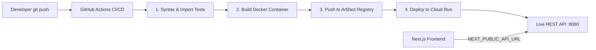

# Google Cloud Platform (GCP) Deployment & CI/CD Guide

This guide walks you through deploying the **Watershed Signal Python Backend** (`project/`) to **Google Cloud Run** using automated CI/CD with **GitHub Actions** and **GCP Artifact Registry**.

---

## Architecture Overview



- **Container Base**: Python 3.12-slim with OpenMP (`libgomp1`) and pinned PyTorch CPU (`2.6.0`).
- **Server**: Unbuffered Python HTTP API server ([`app/api_server.py`](file:///c:/Users/abhay/OneDrive/Desktop/watershed_SIH/project/app/api_server.py)) running on `HOST=0.0.0.0` and port `8080`.
- **Compute**: Google Cloud Run (2 vCPUs, 2 GB RAM, auto-scales to zero when idle).

---

## Phase 1: One-Time Google Cloud Setup

If you have `gcloud` installed, run these commands in your terminal or Google Cloud Shell:

### 1. Set Your GCP Project
```bash
export PROJECT_ID="your-gcp-project-id"
export REGION="asia-south1"   # Mumbai, or us-central1
gcloud config set project $PROJECT_ID
```

### 2. Enable Required Google Cloud APIs
```bash
gcloud services enable \
    run.googleapis.com \
    artifactregistry.googleapis.com \
    cloudbuild.googleapis.com \
    iam.googleapis.com
```

### 3. Create the Artifact Registry Repository
```bash
gcloud artifacts repositories create watershed-repo \
    --repository-format=docker \
    --location=$REGION \
    --description="Watershed Signal Backend Container Images"
```

### 4. Create a Service Account for GitHub Actions CI/CD
```bash
# Create service account
gcloud iam service-accounts create watershed-deployer \
    --description="CI/CD Deployer for GitHub Actions" \
    --display-name="watershed-deployer"

# Assign Cloud Run Admin role
gcloud projects add-iam-policy-binding $PROJECT_ID \
    --member="serviceAccount:watershed-deployer@${PROJECT_ID}.iam.gserviceaccount.com" \
    --role="roles/run.admin"

# Assign Artifact Registry Writer role
gcloud projects add-iam-policy-binding $PROJECT_ID \
    --member="serviceAccount:watershed-deployer@${PROJECT_ID}.iam.gserviceaccount.com" \
    --role="roles/artifactregistry.writer"

# Assign Service Account User role (required for Cloud Run deployment)
gcloud projects add-iam-policy-binding $PROJECT_ID \
    --member="serviceAccount:watershed-deployer@${PROJECT_ID}.iam.gserviceaccount.com" \
    --role="roles/iam.serviceAccountUser"
```

### 5. Generate and Download Service Account JSON Key
```bash
gcloud iam service-accounts keys create gcp-key.json \
    --iam-account="watershed-deployer@${PROJECT_ID}.iam.gserviceaccount.com"
```
> [!CAUTION]
> Keep `gcp-key.json` safe and **never commit it to Git**. You will paste its contents into GitHub Secrets in Phase 2.

---

## Phase 2: Configure GitHub Repository Secrets

In your GitHub repository (`krishx64/watershed_SIH`):
1. Navigate to **Settings** > **Secrets and variables** > **Actions**.
2. Under **Repository secrets**, click **New repository secret** and add:

| Secret Name | Value | Required? | Description |
| :--- | :--- | :--- | :--- |
| `GCP_PROJECT_ID` | `your-gcp-project-id` | **Yes** | Your GCP Project ID |
| `GCP_SA_KEY` | *(Paste entire contents of `gcp-key.json`)* | **Yes** | The JSON key generated in Step 5 |
| `BHUVAN_TOKEN_LULC` | `3ebf75fcd57ed3...` | Optional | ISRO Bhuvan LULC token |
| `REDIS_URL` | `redis://...` | Optional | Connection string if using Redis cache |

*(Optional Variables)*: Under **Repository variables**, you can customize `GCP_REGION` (default is `asia-south1`) and `GCP_SERVICE_NAME` (default is `watershed-backend`).

---

## Phase 3: Triggering CI/CD Deployment

### Automatic Trigger
Every `git push` to `main` or `abhay` that modifies files in `project/` will automatically trigger the GitHub Actions workflow [`.github/workflows/deploy-backend-gcp.yml`](file:///c:/Users/abhay/OneDrive/Desktop/watershed_SIH/.github/workflows/deploy-backend-gcp.yml):
1. Runs Python syntax and import validation.
2. Builds the Docker container with Buildx GHA caching (cutting repeat build time from ~10m to ~1m).
3. Pushes the image to Artifact Registry:
   `${REGION}-docker.pkg.dev/${PROJECT_ID}/watershed-repo/watershed-backend:${SHA}`
4. Deploys to Cloud Run with 2 vCPUs and 2 GB RAM.
5. Curls `${SERVICE_URL}/api/health` to verify live status.

### Manual Trigger
You can trigger deployment at any time:
1. Go to the **Actions** tab on GitHub.
2. Select **Deploy Backend to GCP Cloud Run**.
3. Click **Run workflow**, choose your branch and region, and click **Run**.

---

## Phase 4: Local Container Testing (Before Deploying)

You can verify the containerized backend directly on your computer using Docker:

### Using Docker Compose (Recommended)
```bash
cd project
docker compose up --build
```

### Or Using Standard Docker CLI
```bash
cd project
docker build -t watershed-backend:local .
docker run -p 8080:8080 --env-file .env watershed-backend:local
```

### Test Local Endpoints
Open a new terminal or browser tab:
- Health Check: `http://localhost:8080/api/health`
- Bhuvan Status: `http://localhost:8080/api/bhuvan/status`
- Root Info: `http://localhost:8080/`

---

## Phase 5: Connecting the Next.js Frontend (`web/`)

Once Cloud Run outputs your live service URL (e.g. `https://watershed-backend-xyz.asia-south1.run.app`):

1. **For Local Frontend Development**:
   In `web/.env.local`:
   ```env
   NEXT_PUBLIC_API_URL=https://watershed-backend-xyz.asia-south1.run.app
   ```
2. **For Vercel / Cloud Run Production Frontend**:
   Add `NEXT_PUBLIC_API_URL` to your Vercel or production hosting environment variables with the Cloud Run URL.
